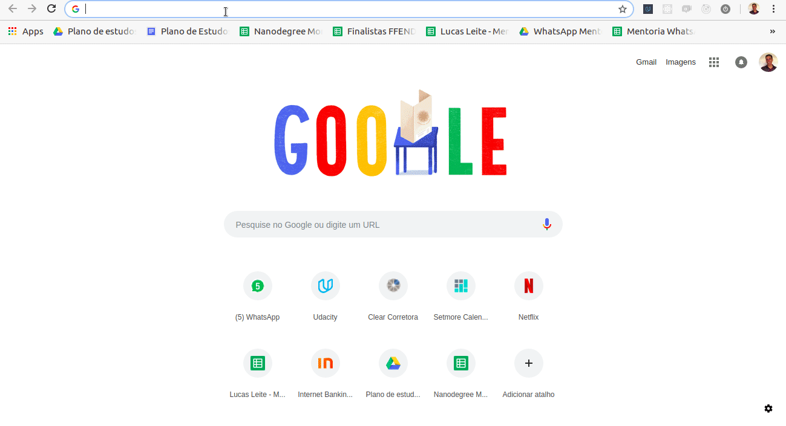
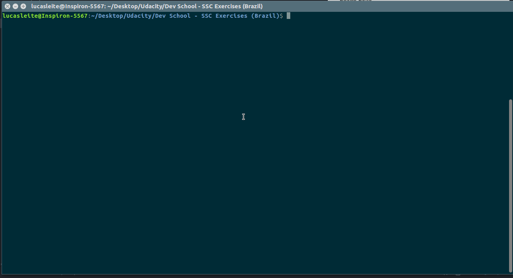
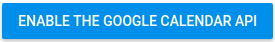
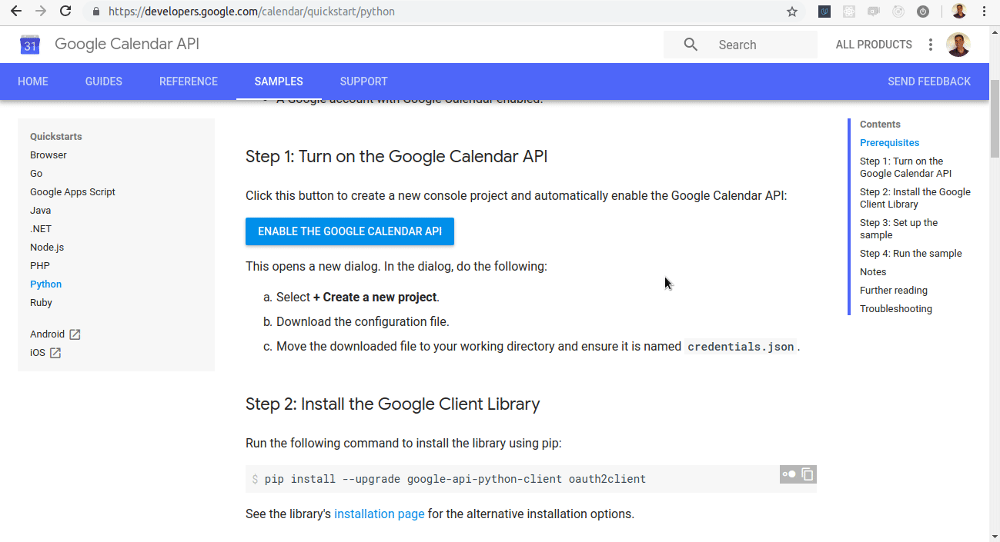
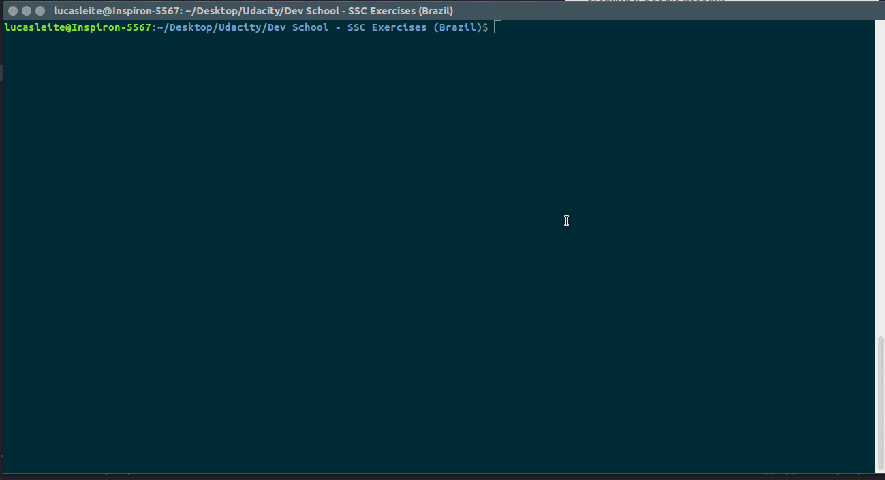
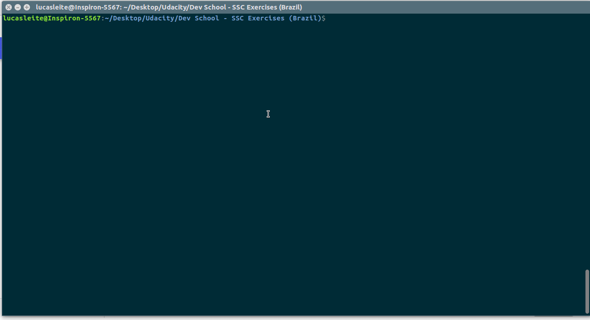
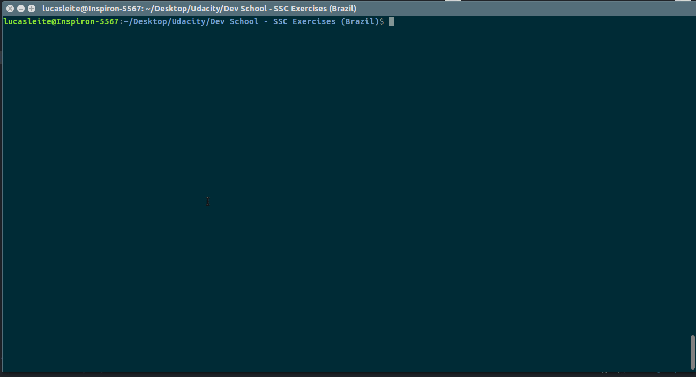
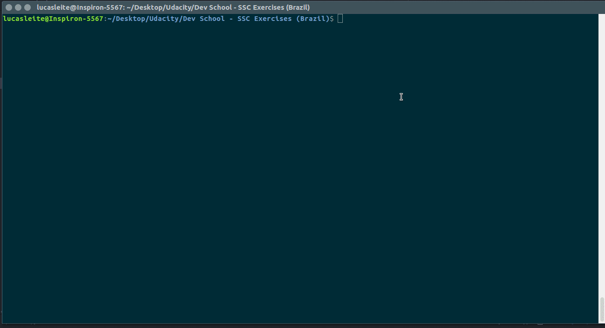
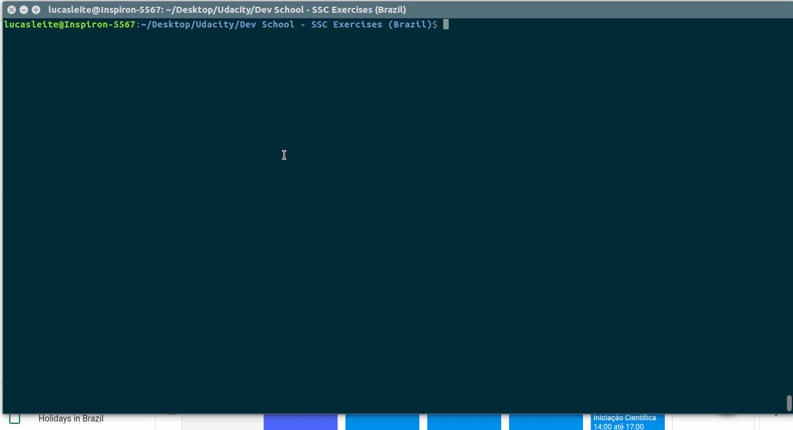
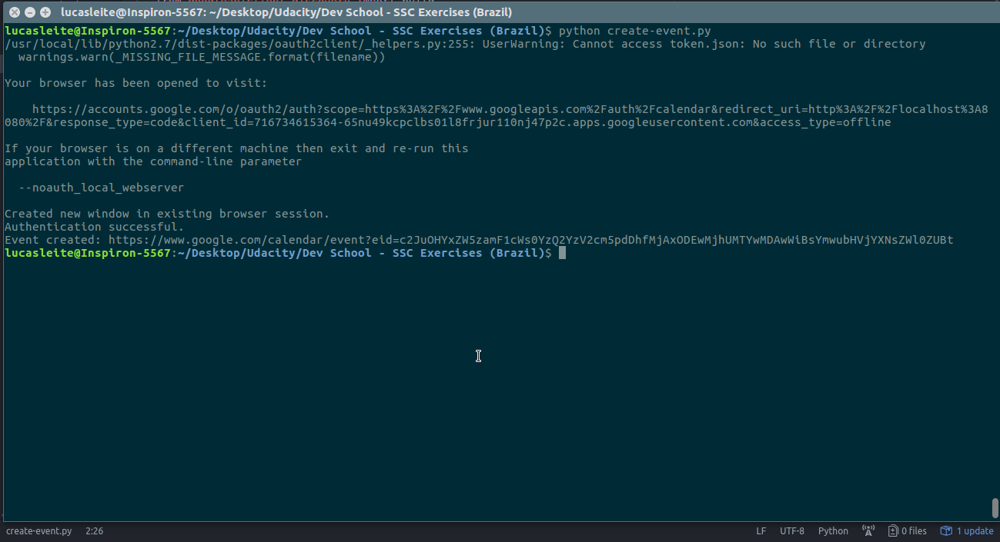

##### Using an API with Python
An Application Program Interface (API) is a set of routines that can be used to access and manipulate data from an external source. For exemple, in this lesson we will be using the Google Calendar API to get your appointments and to schedule a new one.

We will be following [this](https://developers.google.com/calendar/quickstart/python) documentation to get the environment setup and to run an example of a Python program that uses the Google Calendar API.

###### Prerequisites

We already have Python installed, so we only need to install the [pip](https://pypi.org/project/pip/) package management tool and create a Google account.

###### Installing pip

1. Save the `get-pip.py` file accessing `https://bootstrap.pypa.io/get-pip.py` and saving it localy:

1. Open the terminal and run the following command:
```
python get-pip.py
```


###### Creating a Google account
To create a Google account access [this](https://accounts.google.com/SignUp) link and follow the steps.

###### Turn on the Google Calendar API
To be able to work with the Google Calendar API we need to enable the API, and a few steps are required:
1. Access https://developers.google.com/calendar/quickstart/python;
1. Click  button;
 a. Select **+ Create a new project**.  
 b. Download the configuration file.  
 c. Move the downloaded file to your working directory and ensure it is named `credentials.json`  


###### Install the Google Client Library

To install the Google Client Library run the following command:
```
pip install --upgrade google-api-python-client oauth2client
```


###### Create the sample code
Create a file called `quickstart.py` and them copy and paste this code:
```
from __future__ import print_function
import datetime
from googleapiclient.discovery import build
from httplib2 import Http
from oauth2client import file, client, tools

# If modifying these scopes, delete the file token.json.
SCOPES = 'https://www.googleapis.com/auth/calendar.readonly'

def main():
    """Shows basic usage of the Google Calendar API.
    Prints the start and name of the next 10 events on the user's calendar.
    """
    store = file.Storage('token.json')
    creds = store.get()
    if not creds or creds.invalid:
        flow = client.flow_from_clientsecrets('credentials.json', SCOPES)
        creds = tools.run_flow(flow, store)
    service = build('calendar', 'v3', http=creds.authorize(Http()))

    # Call the Calendar API
    now = datetime.datetime.utcnow().isoformat() + 'Z' # 'Z' indicates UTC time
    print('Getting the upcoming 10 events')
    events_result = service.events().list(calendarId='primary', timeMin=now,
                                        maxResults=10, singleEvents=True,
                                        orderBy='startTime').execute()
    events = events_result.get('items', [])

    if not events:
        print('No upcoming events found.')
    for event in events:
        start = event['start'].get('dateTime', event['start'].get('date'))
        print(start, event['summary'])

if __name__ == '__main__':
    main()
```

###### Running the sample code
To run the code, make sure the `credentials.json` file is in the same folder that `quickstart.py` file, and type:
```
python quickstart.py
```


After these steps, when you run the `quickstart.py` program again it will show the 10 upcoming events:


##### Using the Google Calendar API
Now that we have setup the environment to work with the Google Calendar API your task is to do the following:
- Change the `main` function on the `quickstart.py` file to show the 15 upcoming events of your calendar;
- Create an event using the Google Calendar API, and show it using the `quickstart.py` program.

Take a look at this [create events](https://developers.google.com/calendar/create-events) page to implement the second task. Fell free to use the API and to improve your code and to do many things as you wish. Refer to [documentation](https://developers.google.com/calendar/v3/reference/) if needed.

###### Solution

To show the 15 upcoming events we just need to change the line 25 of the `quickstart.py` file, changing `maxResults=10` to `maxResults=15`. Let's see this in action:


And finaly, to create an event we can refer to the [create events](https://developers.google.com/calendar/create-events) page and modify the example code to create an event of ours. Let's create an file called `create-event.py` and paste this code there:
```
from googleapiclient.discovery import build
from oauth2client import file, client, tools

SCOPES = 'https://www.googleapis.com/auth/calendar'

store = file.Storage('token.json')
creds = store.get()
if not creds or creds.invalid:
    flow = client.flow_from_clientsecrets('credentials.json', SCOPES)
    creds = tools.run_flow(flow, store)
service = build('calendar', 'v3', http=creds.authorize(Http()))

event = {
  'summary': 'Google I/O 2015',
  'location': '800 Howard St., San Francisco, CA 94103',
  'description': 'A chance to hear more about Google\'s developer products.',
  'start': {
    'dateTime': '2018-10-28T09:00:00-07:00', # specify here the start datetime
    'timeZone': 'America/Sao_Paulo', # specify here the start timezone
  },
  'end': {
    'dateTime': '2018-10-28T10:00:00-07:00', # specify here the end datetime
    'timeZone': 'America/Sao_Paulo', # specify here the end timezone
  },
  'recurrence': [
    'RRULE:FREQ=DAILY;COUNT=2'
  ],
  'attendees': [
    {'email': 'lpage@example.com'},
    {'email': 'sbrin@example.com'},
  ],
  'reminders': {
    'useDefault': False,
    'overrides': [
      {'method': 'email', 'minutes': 24 * 60},
      {'method': 'popup', 'minutes': 10},
    ],
  },
}

event = service.events().insert(calendarId='primary', body=event).execute()
print 'Event created: %s' % (event.get('htmlLink'))

```
Now, delete the `token.json` file that exists in your work folder and run the program:
```
python create-event.py
```


And to see the new event that was created, let's run the `quickstart.py` again:


We have done a great work! Fell free to improve your code and add more functionalities. Have fun!
